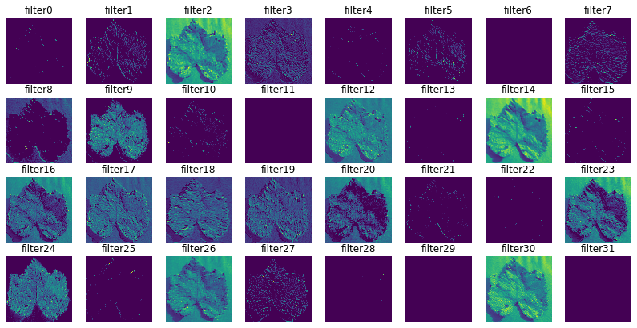
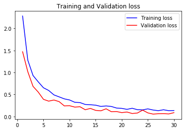
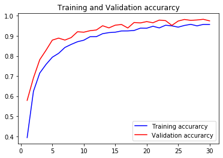
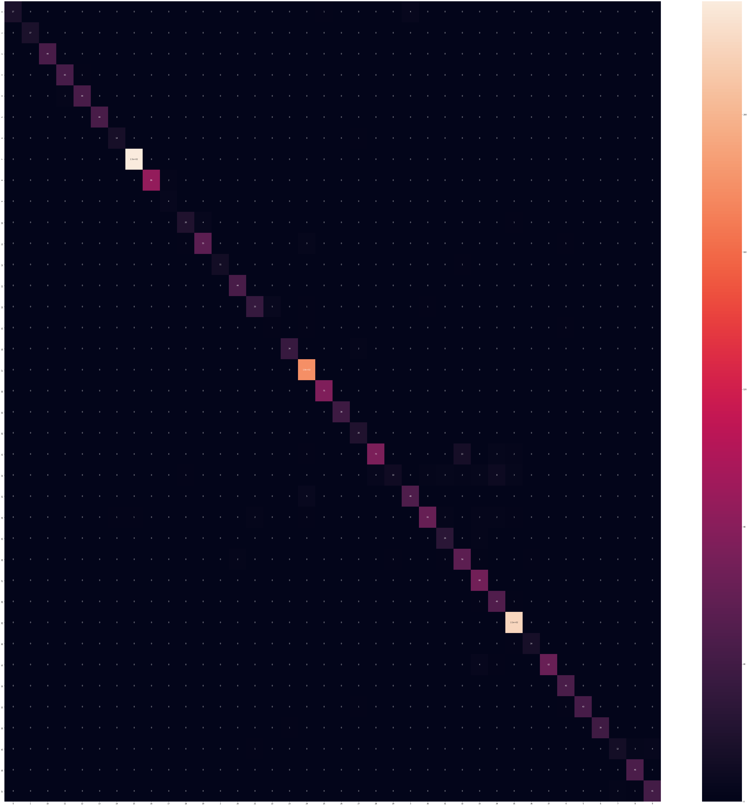
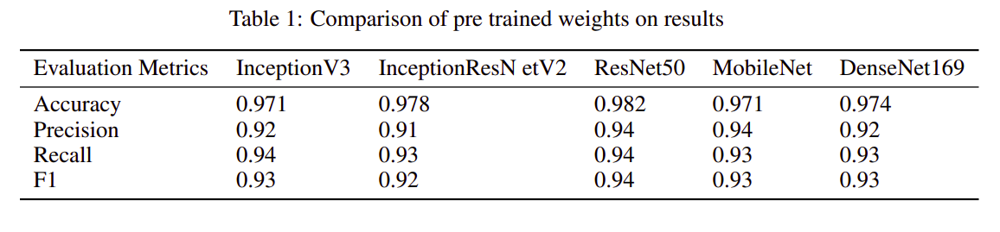

# On Using Transfer Learning For Plant Disease Detection

Code for the paper `On Using Transfer Learning For Plant Disease Detection`.

https://abhinavsagar.github.io/files/plant_cnn.pdf

## Citing

If you find this code useful in your research, please consider citing the paper:

BibTex:

```
@article{sagar2020using,
  title={On Using Transfer Learning For Plant Disease Detection},
  author={Sagar, Abhinav and Dheeba, J},
  journal={bioRxiv},
  year={2020},
  publisher={Cold Spring Harbor Laboratory}
}
```

APA:

`Sagar, A., & Dheeba, J. (2020). On Using Transfer Learning For Plant Disease Detection. bioRxiv.`

## Abstract

Deep neural networks has been highly successful in image classification problems. In this paper, we show how neural networks can be used for plant disease
recognition in the context of image classification. We have used publicly available
Plant Village dataset which has 38 classes of diseases. Hence, the problem that we
have addressed is a multi class classification problem. We compared five different
architectures including VGG16, ResNet50, InceptionV3, InceptionResNet and
DenseNet169 as the backbones for our work. We found that ResNet50 achieves
the best result on the test set. For evaluation, we used metrics: accuracy, precision,
recall, F1 score and class wise confusion metric. Our model achieves the best of
results using ResNet50 with accuracy of 0.982, precision of 0.94, recall of 0.94
and F1 score of 0.94.

## Data

The dataset can be downloaded from [here](https://github.com/spMohanty/PlantVillage-Dataset).

## Environment and tools

1. Jupyter Notebook
2. Numpy
3. Pandas
4. Scikit-image
5. Matplotlib
6. Scikit-learn
7. Keras

## Installation

`pip install numpy pandas scikit-image matplotlib scikit-learn keras`

`jupyter notebook`

## Results

### Visualization of Feature Maps



### Loss vs Epoch



### Accuracy vs Epoch



### Confusion Matrix



### Comparison of pre trained weights on results




## License

```
MIT License

Copyright (c) 2020 Abhinav Sagar

Permission is hereby granted, free of charge, to any person obtaining a copy
of this software and associated documentation files (the "Software"), to deal
in the Software without restriction, including without limitation the rights
to use, copy, modify, merge, publish, distribute, sublicense, and/or sell
copies of the Software, and to permit persons to whom the Software is
furnished to do so, subject to the following conditions:

The above copyright notice and this permission notice shall be included in all
copies or substantial portions of the Software.

THE SOFTWARE IS PROVIDED "AS IS", WITHOUT WARRANTY OF ANY KIND, EXPRESS OR
IMPLIED, INCLUDING BUT NOT LIMITED TO THE WARRANTIES OF MERCHANTABILITY,
FITNESS FOR A PARTICULAR PURPOSE AND NONINFRINGEMENT. IN NO EVENT SHALL THE
AUTHORS OR COPYRIGHT HOLDERS BE LIABLE FOR ANY CLAIM, DAMAGES OR OTHER
LIABILITY, WHETHER IN AN ACTION OF CONTRACT, TORT OR OTHERWISE, ARISING FROM,
OUT OF OR IN CONNECTION WITH THE SOFTWARE OR THE USE OR OTHER DEALINGS IN THE
SOFTWARE.
```
